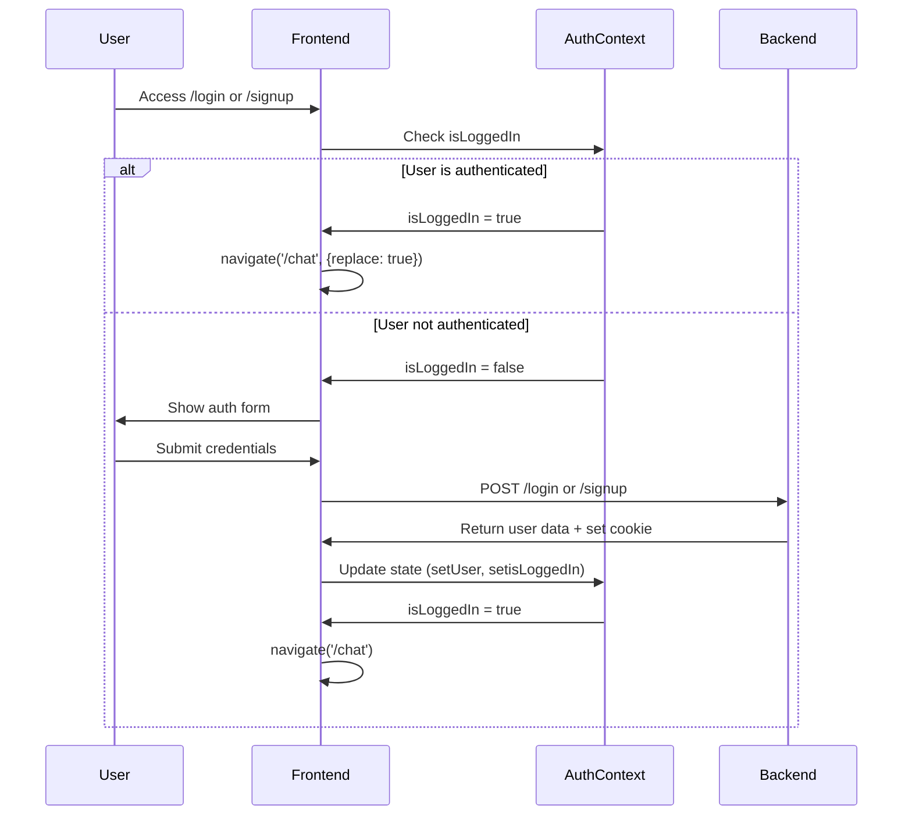

# User Authentication Redirect Feature Design

## Overview

This document outlines the design for implementing an authentication-based redirect system that automatically redirects authenticated users away from signin/signup pages to the chat interface. The feature ensures authenticated users cannot access authentication forms unnecessarily, providing a seamless user experience.

## Technology Stack & Dependencies

- **Frontend Framework**: React with TypeScript
- **Routing**: React Router v6
- **State Management**: React Context API
- **Authentication**: Cookie-based JWT authentication
- **HTTP Client**: Axios
- **Notifications**: React Hot Toast

## Component Architecture

### Authentication Context Structure

```mermaid
graph TD
    A[AuthProvider] --> B[AuthContext]
    B --> C[useAuth Hook]
    C --> D[Login Component]
    C --> E[Signup Component] 
    C --> F[Chat Component]
    C --> G[App Router]
    
    B --> H[Authentication State]
    H --> I[user: User | null]
    H --> J[isLoggedIn: boolean]
    
    B --> K[Authentication Methods]
    K --> L[login]
    K --> M[signup]
    K --> N[logout]
```

### Component Hierarchy

| Component | Role | Authentication Dependencies |
|-----------|------|---------------------------|
| `AuthProvider` | Root authentication context provider | - |
| `App` | Main router with conditional routing | `useAuth()` |
| `Login` | Authentication form with redirect logic | `useAuth()` |
| `Signup` | Registration form with redirect logic | `useAuth()` |
| `Chat` | Protected chat interface | `useAuth()` |

### Authentication State Management

The authentication system uses React Context to manage user state globally:

- **Initial State**: Automatically checks for valid authentication cookies on app load
- **State Updates**: Updates occur during login, signup, and logout operations
- **Persistence**: Authentication state persists via HTTP-only cookies

## Routing & Navigation

### Current Routing Architecture

The application implements conditional routing based on authentication status:

```mermaid
graph LR
    A[User Access] --> B{Authenticated?}
    B -->|Yes| C[Authenticated Routes]
    B -->|No| D[Public Routes]
    
    C --> E[/ - Home]
    C --> F[/chat - Chat]
    C --> G[/demo - Demo]
    
    D --> H[/ - Home]
    D --> I[/login - Login]
    D --> J[/signup - Signup]
    D --> K[/demo - Demo]
```

### Authentication Redirect Logic

| User State | Current Route | Action | Target Route |
|------------|---------------|--------|--------------|
| Authenticated | `/login` | Redirect | `/chat` |
| Authenticated | `/signup` | Redirect | `/chat` |
| Authenticated | `/chat` | Allow | `/chat` |
| Unauthenticated | `/chat` | Redirect | `/login` |
| Unauthenticated | `/login` | Allow | `/login` |
| Unauthenticated | `/signup` | Allow | `/signup` |

## API Integration Layer

### Authentication API Endpoints

| Endpoint | Method | Purpose | Response |
|----------|--------|---------|----------|
| `/api/users/auth-status` | GET | Verify authentication status | User data or error |
| `/api/users/login` | POST | User authentication | User data + cookie |
| `/api/users/signup` | POST | User registration | Success message |
| `/api/users/logout` | GET | User logout | Success + cookie clearing |

### Authentication Flow



## Business Logic Layer

### Authentication Guard Implementation

The authentication redirect is implemented using React's `useEffect` hook within both Login and Signup components:

```typescript
// Authentication redirect logic
useEffect(() => {
    if (auth?.isLoggedIn) {
        navigate('/chat', { replace: true });
    }
}, [auth?.isLoggedIn, navigate]);
```

### Key Implementation Details

1. **Replace Navigation**: Uses `replace: true` to prevent back button issues
2. **Dependency Array**: Monitors `auth?.isLoggedIn` changes
3. **Immediate Execution**: Runs on component mount and auth state changes
4. **Navigation Hook**: Utilizes React Router's `useNavigate` for programmatic navigation

### Edge Case Handling

| Scenario | Current Handling | Improvement Needed |
|----------|------------------|-------------------|
| Authentication in progress | Basic loading state | Enhanced loading UI |
| Network failure during auth check | No specific handling | Error boundary needed |
| Expired session on protected routes | Manual redirect in Chat component | Global auth guard |
| Deep link to auth pages while authenticated | Proper redirect implemented | ✅ Working |

## Testing Strategy

### Unit Testing Requirements

1. **Authentication Context Tests**
   - Initial state verification
   - State updates during login/logout
   - Cookie validation on app load

2. **Component Redirect Tests**
   - Login component redirect when authenticated
   - Signup component redirect when authenticated
   - Chat component redirect when unauthenticated

3. **Navigation Tests**
   - Proper route protection
   - Replace vs push navigation behavior
   - Back button functionality

### Integration Testing

1. **End-to-End Authentication Flow**
   - Complete signup → auto-login → redirect to chat
   - Login → redirect to chat
   - Logout → redirect to login
   - Protected route access attempts

2. **Router Behavior Testing**
   - Deep link handling
   - Browser refresh scenarios
   - Multiple tab scenarios

## Security Considerations

### Authentication Security

- **HTTP-Only Cookies**: Prevents XSS attacks on authentication tokens
- **Domain Restrictions**: Cookies limited to specific domain
- **Expiration Handling**: 7-day token expiration with automatic renewal
- **CORS Configuration**: Restricted to allowed origins

### Navigation Security

- **Replace Navigation**: Prevents authentication state leakage in browser history
- **Route Protection**: Conditional routing prevents unauthorized access
- **State Validation**: Authentication state verified on each route change

## Performance Optimization

### Authentication State Management

- **Single Source of Truth**: Centralized authentication context
- **Minimal Re-renders**: Efficient state updates with proper dependency arrays
- **Cookie-based Persistence**: Reduces API calls for authentication verification

### Navigation Performance

- **Immediate Redirects**: No unnecessary page rendering for authenticated users
- **Lazy Loading**: Components loaded only when needed
- **Memory Management**: Proper cleanup of event listeners and subscriptions

## Implementation Checklist

### Current Implementation Status

- ✅ Authentication context with state management
- ✅ Login component with redirect logic
- ✅ Signup component with redirect logic  
- ✅ Chat component with authentication guard
- ✅ Conditional routing based on auth status
- ✅ Cookie-based authentication persistence

### Enhancement Opportunities

- [ ] Global authentication guard component
- [ ] Enhanced loading states during authentication checks
- [ ] Error boundary for authentication failures
- [ ] Automated testing suite for authentication flows
- [ ] Session timeout handling with automatic refresh
- [ ] Multi-tab synchronization for authentication state